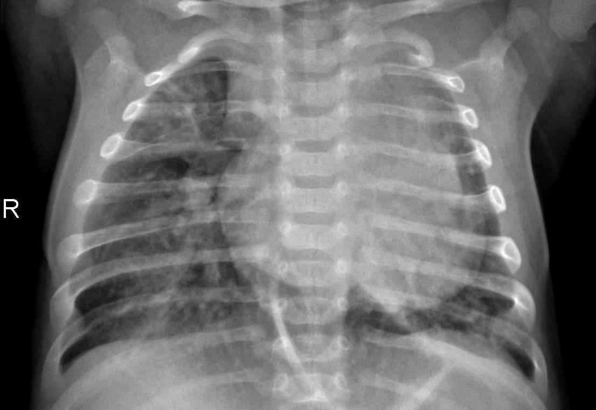
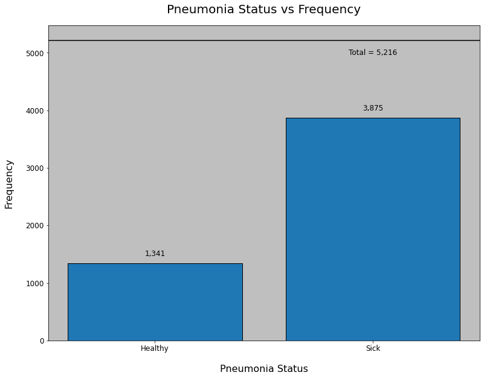
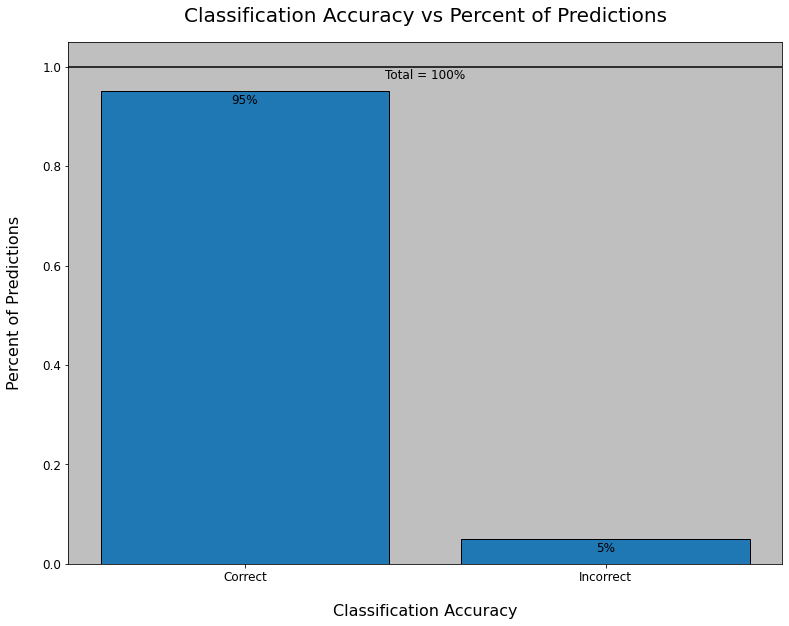

# detecting-pneumonia-with-deep-learning
Using a chest x-ray image, can we predict whether a patient has pneumonia?

# Detecting Pneumonia with Deep Learning

**Authors:** Ian Butler, Red the dog

***

## Overview

A one-paragraph overview of the project, including the business problem, data, methods, results and recommendations.

In undeveloped areas of the world, pneumonia is one of the top five leading causes of death in children under the age of five. This project seeks to use deep learning neural networks to predict whether or not children have pneumonia so that proper treatment can be administered more quickly and more effectively. The data we used comes from the Guangzhou Women and Children’s Medical Center in Guangzhou, China and is a collection of chest x-rays of children between the ages of 1 and 5. We used densely connected neural networks and convolutional neural networks to achieve a classification accuracy of 95% on unseen data. Based on the performance of this neural network, we recommend undeveloped communities adopt this model in for use with the chest x-rays they already have access to, in order to expedite the diagnostic process and save lives.

***

## Data Understanding

A description of the data being used for this project.

***

Questions to consider:
* Where did the data come from, and how do they relate to the data analysis questions?
    * The data comes to us from Kaggle.
    * The data comes originally from the Guangzhou Women and Children’s Medical Center in Guangzhou, China.
    * The data relates to the project in that it is a collection of chest x-rays of normal and pneumonic lungs.
* What do the data represent? Who is in the sample?
    * Each entry in the data is one chest x-ray, having normal lung condition, viral pneumonia, or bacterial pneumonia.
    * The sample consists of 5,856 of pediatric patients one to five years old.
* What is the target class?
    * The target class is whether a patient has normal lungs or pneumonic lungs.
    * There is no distinction in this project between identifying viral or bacterial pneumonia.

For further reading on the data in the environment from which it was accessed, please consult the following URL:
https://www.kaggle.com/datasets/paultimothymooney/chest-xray-pneumonia

A brief description of the data from the above site is as follows:

"The dataset is organized into 3 folders (train, test, val) and contains subfolders for each image category (Pneumonia/Normal). There are 5,863 X-Ray images (JPEG) and 2 categories (Pneumonia/Normal).

Chest X-ray images (anterior-posterior) were selected from retrospective cohorts of pediatric patients of one to five years old from Guangzhou Women and Children’s Medical Center, Guangzhou. All chest X-ray imaging was performed as part of patients’ routine clinical care.

For the analysis of chest x-ray images, all chest radiographs were initially screened for quality control by removing all low quality or unreadable scans. The diagnoses for the images were then graded by two expert physicians before being cleared for training the AI system. In order to account for any grading errors, the evaluation set was also checked by a third expert."

***

Based on the above visualization, it is clear to see that we have many more images of pneumatic lungs in our training set than we do of healthy lungs. However, the class may not be so imbalanced that the distribution is an issue. The sick images constitute approximately 74% percent of our training set, leaving the healthy images with a share of 26%. This distribution will not prove to be an issue in our final model.

## Data Modeling
A description and justification of the process for modeling the data.

***

Questions to consider:
* How did you analyze or model the data?
    * We modeled the data using densely connected neural networks and convolutional neural networks.
* How did you iterate on your initial approach to make it better?
    * We tuned various hyperparameters, including the learning rate, the strength of regularization, and the type of optimizer.
    * Perhaps most importantly, we properly split the data.
* Why are these choices appropriate given the data and the business problem?
    * Neural networks, particularly convolutional neural networks, are particularly well-suited to image classification.

***

Achieving an accuracy of 95% on unseen data, we feel satisfied that this model performs well enough for our purposes and are proud of our results.

## Evaluation
An evaluation of how well our work solves the organization's stated problems.

***

Questions to consider:
* How do you interpret the results?
    * Based on the accuracy score of our final model, we can say that the model, called PneuNet in presentation, 
    can accurately classify a patient as being healthy or having pneumonia 95% of the time.
* How well does your model fit your data? How much better is this than your baseline model?
    * The model fits the data quite well. It is significantly better than the baseline model.
* How confident are you that your results would generalize beyond the data you have?
    * We are quite confident that our results would generalize beyond the data that we have.
    * It is, however, important to note that the images the network was trained on were already thoroughly quality controlled, so new images would likely have to be of a similar level of image pre-processing to be usable by the network.
* How confident are you that this model would benefit the organization if put into use?
    * We are very confident that this model would benefit the communities it serves if put into use.
    * If this model was deployed in areas with limited medical expertise, it could dramatically reduce the time it takes to accurately identify children with pneumonia.

***

## Conclusions
A provision of our conclusions about the work we've done, including any limitations or next steps.

***

Questions to consider:
* What would you recommend the business do as a result of this work?
    * We recommend the organization deploy the model using chest x-rays of children, 
    in order to determine whether they have pneumonia.
* What are some reasons why your analysis might not fully solve the business problem?
    * Despite its accuracy, PneuNet is not perfect. It will incorrectly classify children 5% of the time, 
    which is still a high number of children in the context of hundreds of thousands of patients.
* What else could you do in the future to improve this project?
    * In the future, we would like to deploy more robust models with a proper train/test/validation split.

***
